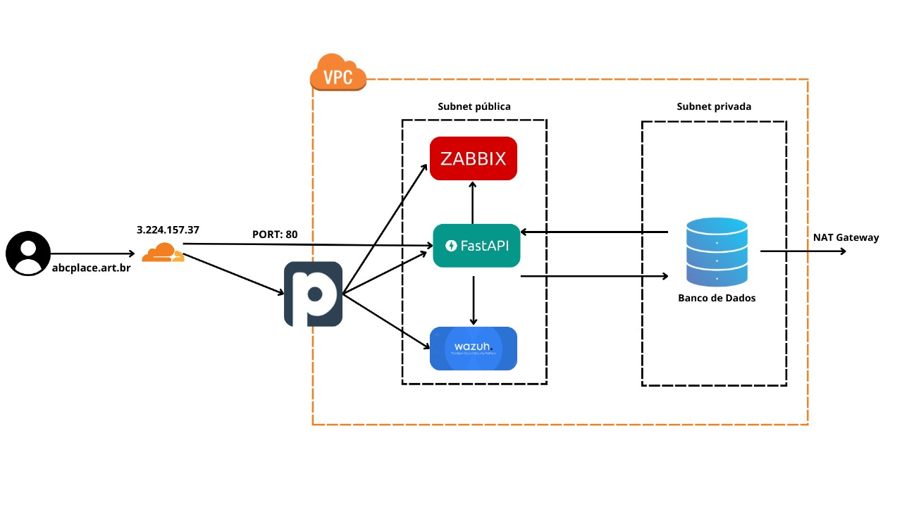
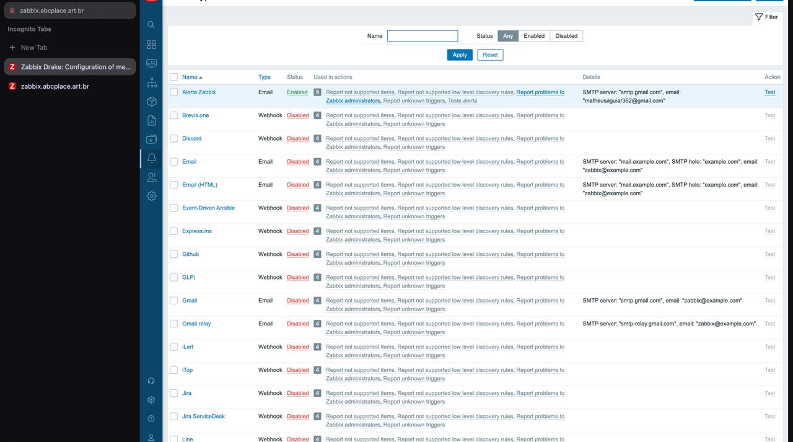

# AF CyberSecurity

## Nome dos Participantes

- **Erik Leonardo**
- **Gustavo Antony de Assis**
- **Matheus Aguiar**

---

## Projeto

### 1. **Descrição da Arquitetura do Sistema**

A arquitetura da rede é dividida em duas sub-redes:

- **Sub-rede pública**: Hospeda a API e as ferramentas de monitoramento **Zabbix** e **Wazuh**.
- **Sub-rede privada**: Contém o banco de dados, configurado para comunicação externa apenas por meio de um **NAT Gateway**, garantindo maior segurança ao isolar o banco de dados de acessos diretos da internet.

#### Fluxo de Tráfego

- **Cloudflare**: Desempenha um papel essencial na segurança e desempenho, redirecionando o tráfego com base na porta de destino:
  - **Porta 80 (HTTP)**: O tráfego é enviado diretamente para o **FastAPI**, sem passar pelo jumper.
  - **Outras portas**: O tráfego é encaminhado para o **jumper**, que funciona como um proxy centralizado. O **jumper** gerencia o roteamento para as aplicações internas, como **Zabbix** e **Wazuh**, além de atuar como um ponto de controle para otimizar e proteger os fluxos internos.

Essa arquitetura utiliza o **Cloudflare** para reforçar a segurança, oferecendo proteção contra ataques DDoS, enquanto o **jumper** proporciona flexibilidade no gerenciamento do tráfego interno.

#### Segurança do Banco de Dados

O **banco de dados** localizado na sub-rede privada só pode ser acessado pela **API** hospedada na sub-rede pública ou via **jump server**. Isso garante um ambiente mais seguro, isolando o banco de dados de acessos externos.

#### Ferramentas de Monitoramento

- **Zabbix**: Focado em monitorar a infraestrutura, com funcionalidades como disponibilidade, desempenho e análise de métricas de servidores e redes.
- **Wazuh**: Voltado para segurança, com foco em análise de logs, detecção de intrusão e conformidade com padrões regulatórios, como PCI DSS e GDPR.
- **Pritunl**: Utilizado para configurar o **jump server**, permitindo a conexão e gerenciamento dos usuários. Possibilita a autenticação com **MFA** para acessar os recursos internos da VPC.

Essa arquitetura, com a separação clara entre sub-redes, o uso estratégico do **jumper** e a proteção do **Cloudflare**, assegura tanto a observabilidade e desempenho da infraestrutura quanto a segurança do ambiente operacional.

---

### 2. **Diagrama de Arquitetura**

---

### 3. **Evidências de Testes de Segurança**

(Adicionar aqui as evidências conforme necessário)

---

### 4. **Vídeo Demonstrativo do Ambiente em Funcionamento**

Confira o vídeo com uma demonstração do ambiente em funcionamento (até 7 minutos):

---

### 5. **Alerta Configurado no Zabbix**

---

### 6. **Teste do Alerta Feito via Zabbix**

---
